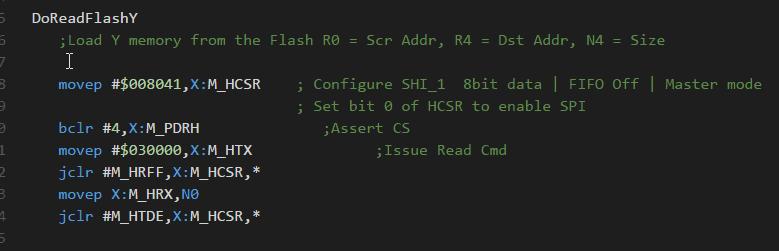
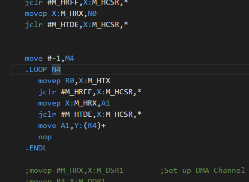
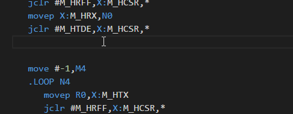

# Motorola DSP56300 Assembly Language Support

## Functionality

Provides DSP56300 assembly syntax highlighting and some additional features: 

Recognizes IF 0 .... ENDIF construction and highlights code appropriately:

Highlights keyword pairs (like .loop/.endl, .if/.else/.endi and etc):

Autocompletes structured control blocks (.loop/.endl, .while/.endw, and etc):

## Installation

Make a new folder `olegskydan.DSP56300` in the `<user home>/.vscode/extensions` folder. 
Copy files into `<user home>/.vscode/extensions/olegskydan.DSP56300` folder and restart Code.

## License

[MIT](LICENSE) &copy; Oleg Skydan
